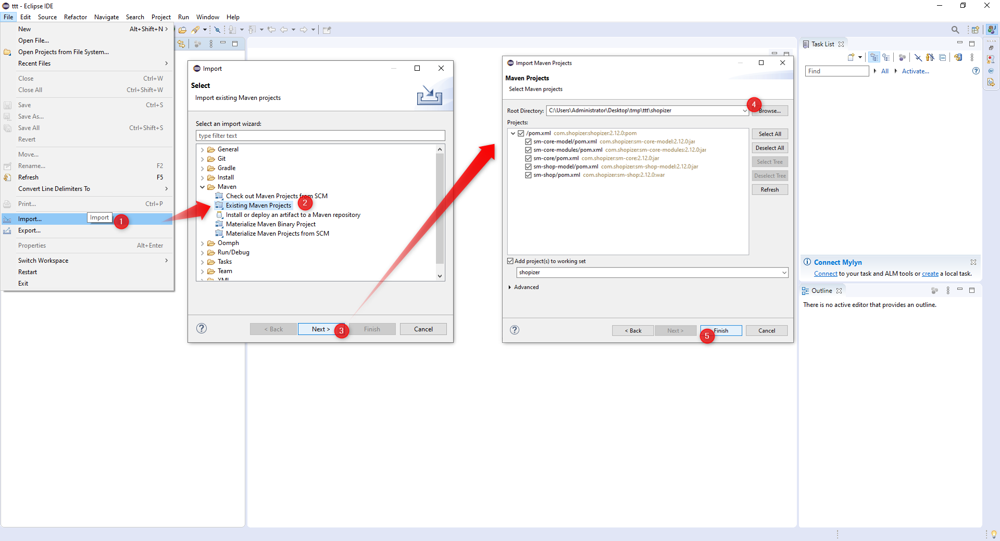
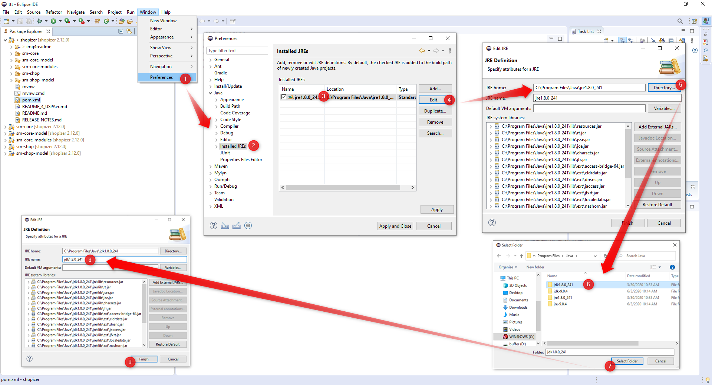
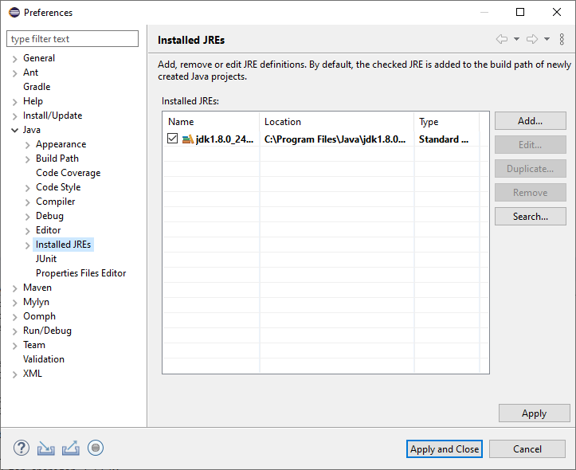
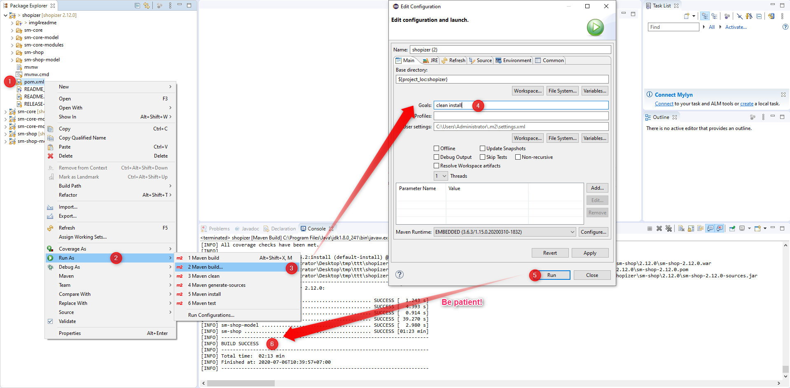
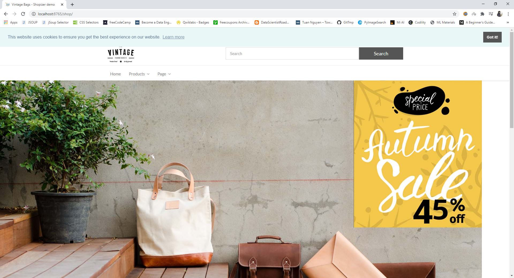

# Deploy Shopizer with Docker

Prerequisites:
- Docker installed
- java8 installed
- Terminal(linux)/powershell(windows)

Get the code:
-------------------     

	 $ git clone https://github.com/USPA-Technology/shopizer
   
   
Open project in eclipse
-------------------

Configure eclipse as follows
-------------------	

Window > Preferences > Java > Installed JREs

make sure we use jdk not jre (if jre shown, click edit and browse to jdk path as below)

after all, 

when things are settled, click "apply" button then "apply and close" button
	
Prepare for deployment
-------------------

It takes long time due to dowloading so many libraries, please wait until build process finishes. And then, make sure there is `ROOT.war` file inside folder `shopizer/sm-shop/target`, docker will use this file to deploy web app.

Run with docker
-------------------

We will this app with docker from port 8765 (just my random choice, please change if you want)

Run following commands in terminal/powershell one by one,

	$ cd shopizer/sm-shop
	$ docker build -t shopizer .
	$ docker run -p 8765:8080 shopizer

Everything is ok, if you see similar lines below at the end,

	06-Jul-2020 03:54:56.034 INFO [main] org.apache.coyote.AbstractProtocol.start Starting ProtocolHandler ["http-nio-8080"]
	06-Jul-2020 03:54:56.044 INFO [main] org.apache.coyote.AbstractProtocol.start Starting ProtocolHandler ["ajp-nio-8009"]
	06-Jul-2020 03:54:56.047 INFO [main] org.apache.catalina.startup.Catalina.start Server startup in 25574 ms

Now open browser and navigate to `localhost:8765`, you should see the shopizer website

For further details on website demonstration, please refer to original `README.md`.